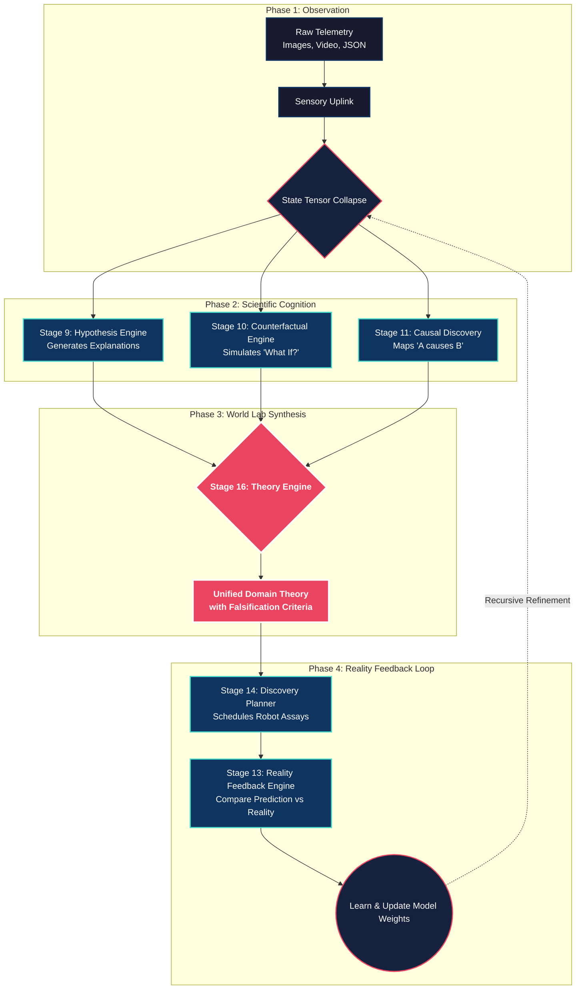

# OMEGA-CORE Standard Operating Procedure
## SOP-17: World Lab Pipeline & Theory Engine Operation

**Domain:** Multi-Disciplinary Universal Scientific Cognition
**Stage:** 16 (World Lab Integration)
**Status:** ✅ Active Production

---

### 1. Architectural Flowchart (The Scientific Loop)

The following diagram illustrates the complete cognitive flow of the World Lab pipeline. It demonstrates how raw unstructured data collapses into a State Tensor, propagates through the causality and counterfactual engines, and is finally synthesized into a falsifiable Scientific Theory by the **Theory Engine**.



---

### 2. How To Use The Pipeline

With the integration of the `TheoryEngine`, you no longer need to manually piece together hypotheses and simulations. The system autonomously unifies them.

#### Step 1: Ingest Data via Custom Feed
1. Open the OMEGA-CORE Dashboard.
2. Navigate to **CUSTOM JSON FEEDS** or the **MULTI-MODAL COGNITIVE SCANNER**.
3. Upload your domain-specific dataset (e.g., Finance JSON, Cyclone Satellite Image, or Quantum Curve parameters).

#### Step 2: Trigger the Tensor Collapse
1. Click **⚡ Diffuse Sequence to JSON**.
2. The framework will convert your inputs into universal physical measurements: `Entropy`, `Coherence`, `Emergence`, `Bifurcation`, and `Reducibility`.

#### Step 3: Run the World Lab Execution Script
If you want to run the automated, headless integration sequence across all domains (like the test suite we just built), execute the test script from your terminal:
```bash
# Ensure UTF-8 Encoding for the console display
$env:PYTHONIOENCODING="utf-8"

# Run the World Lab script
python test_world_lab.py
```

#### Step 4: Review the Generated Theory
The system will bypass standard LLM token-prediction and output a strict **Causal Theory**.
Review the output for the following crucial components:
* **The Unified Theory Name:** The categorized framework (e.g., "Unified Quantum_gravity Dynamics Theory").
* **Identified Causal Nodes:** How many structural dependencies were discovered (e.g., "Identified 12 causal nodes").
* **Recommended Counterfactual:** The highest-scoring simulated intervention (e.g., "Reduce Temperature 20mK").
* **Falsification Criteria:** *This is the most important output.* The Theory Engine bounds the theory by stating exactly what physical observation would **PROVE THE THEORY WRONG** (e.g., "Scale goes to Planck without curvature increase").

#### Step 5: Schedule Discovery
If the theory confidence is below the threshold, take the **Falsification Criteria** and feed it into the `Discovery Planner` to automatically schedule the next physical/virtual experiment!
